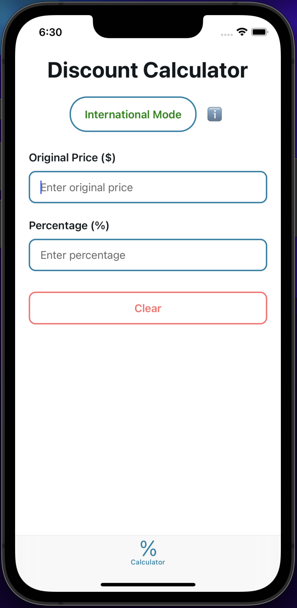
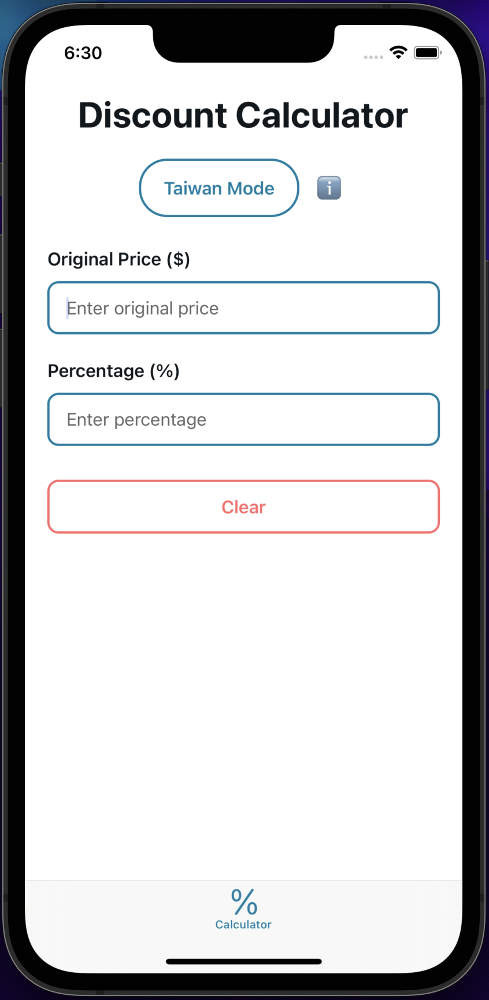

# Percentage Discount Calculator 📱💰

A React Native mobile application built with Expo that helps users calculate discounts and final prices with support for both Taiwan and International percentage calculation modes.

## Features

- **Dual Mode Support**: Switch between Taiwan mode and International mode for different percentage calculations
  - **International Mode**: Percentage represents discount (e.g., 65% = 65% off, you pay 35%)
  - **Taiwan Mode**: Percentage represents what you pay (e.g., 65% = you pay 65%, 35% discount)
- **Real-time Calculations**: Instant results as you type
- **Clean Mobile UI**: Designed for mobile-first experience with responsive layout
- **Theme Support**: Automatic light/dark mode support
- **Input Validation**: Ensures valid price and percentage values
- **Clear Results Display**: Shows original price, discount amount, and final price

## Screenshots




## Technology Stack

- **React Native** - Cross-platform mobile development
- **Expo** - Development platform and build tools
- **TypeScript** - Type-safe JavaScript
- **Expo Router** - File-based navigation
- **React Native Safe Area Context** - Safe area handling

## How to Use

### Basic Usage

1. **Select Mode**: Choose between Taiwan Mode or International Mode using the toggle button
2. **Enter Original Price**: Input the original price of the item
3. **Enter Percentage**: Input the percentage value (0-100)
4. **View Results**: See the calculated discount amount and final price
5. **Clear Inputs**: Use the Clear button to reset all fields

### Mode Differences

- **International Mode**:

  - Input: $100 original price, 30%
  - Result: 30% discount ($30 off), final price: $70

- **Taiwan Mode**:
  - Input: $100 original price, 70%
  - Result: You pay 70% ($70), discount: $30

### Tips

- Tap the ℹ️ info button for mode explanations
- The app validates inputs and shows error messages for invalid values
- Results update automatically as you type

## Project Structure

```
app/
├── (tabs)/
│   ├── index.tsx          # Main calculator screen
│   └── _layout.tsx        # Tab layout configuration
├── _layout.tsx            # Root layout with theme provider
└── +not-found.tsx         # 404 page

components/
├── ThemedText.tsx         # Themed text component
├── ThemedView.tsx         # Themed view component
└── ui/                    # UI components

constants/
└── Colors.ts              # Theme colors

hooks/
├── useColorScheme.ts      # Color scheme detection
└── useThemeColor.ts       # Theme color utilities

assets/
├── images/                # App images and icons
└── fonts/                 # Custom fonts
```

## Development

### Available Scripts

- `npm start` - Start the Expo development server
- `npm run android` - Start on Android emulator
- `npm run ios` - Start on iOS simulator
- `npm run web` - Start web version
- `npm run lint` - Run ESLint

### Building for Production

For production builds, follow the [Expo build documentation](https://docs.expo.dev/build/introduction/).

## Acknowledgments

- Built with [Expo](https://expo.dev)
- Uses [React Native](https://reactnative.dev)
- Developed for CSE310 Applied Programming course

## Contact

[@SpencerSedano](https://github.com/SpencerSedano)

Project Link: [https://github.com/SpencerSedano/percentage](https://github.com/SpencerSedano/percentage)
